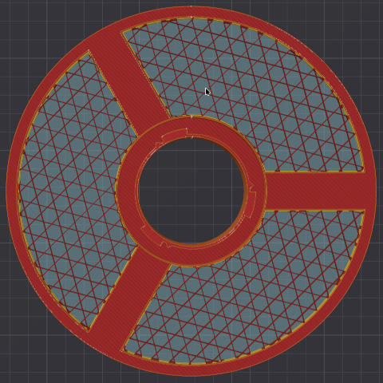
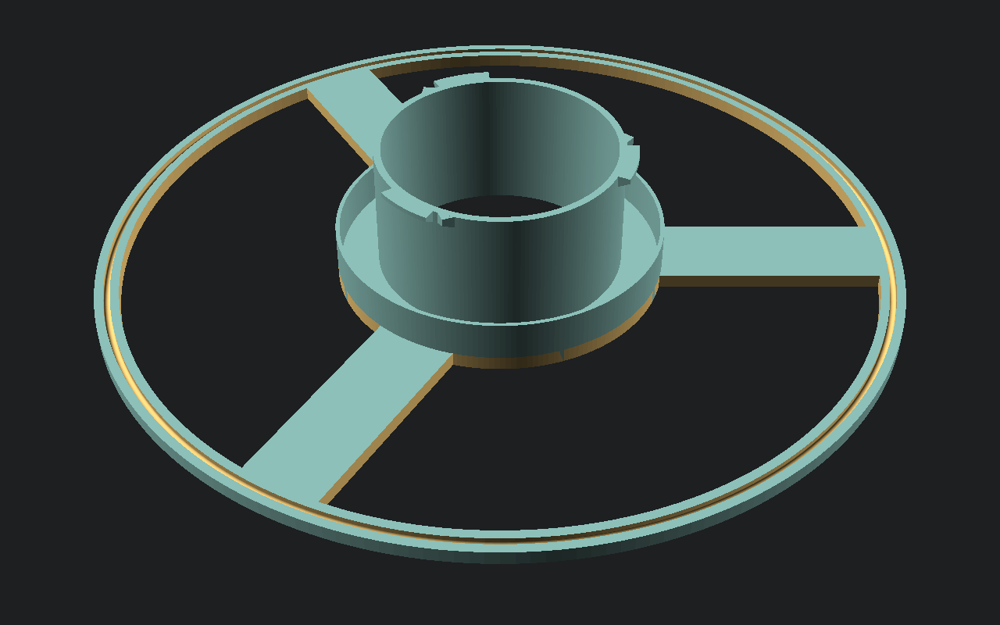
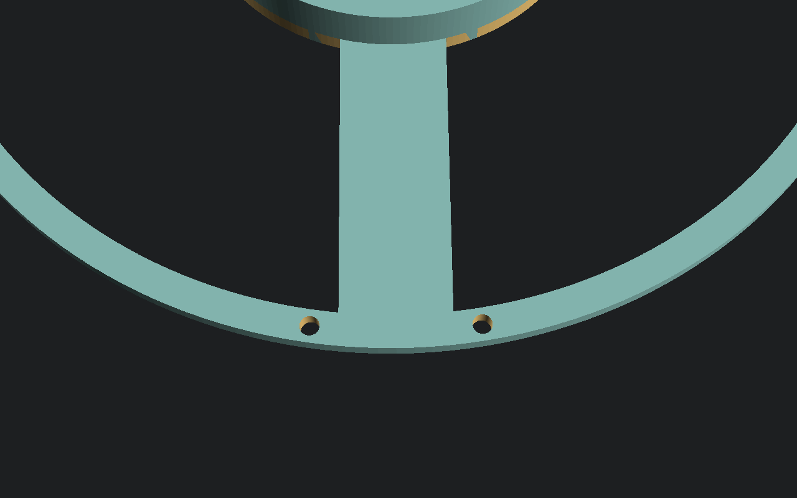
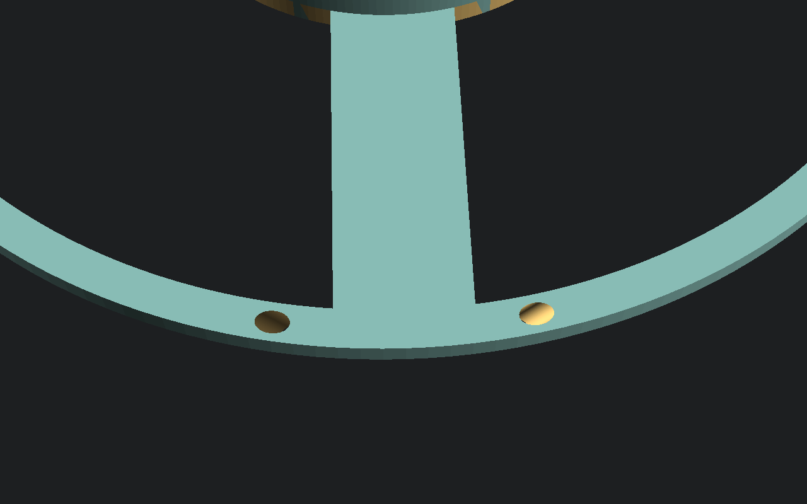

# OpenSCADSpool
Parametrizable spool primary for 3d filament

## Parameters

### flange_cutout_keep
This option keeps the cutout segment in the 3d model. You can use the slicer to make a nice wall:

1. Set "flange_cutout_keep" to true
2. Export as AMF
3. Select cutout in slicer
4. Change slicer parameters by object
   - Top shell layers: 0
   - Bottom shell layers: 0
   - Sparse infill density: Your choice
   - Sparse infill pattern: Choose between Rectilinear, Grid, Triangles, Tri-hexagon, Honeycomb or Zig Zag
5. Slice

### flange_filament_clip
A notch in the flange border to hold the filament

### flange_filament_hole_bambu
Two holes for filament fixation like on BambuLab spools.

### flange_filament_hole_inclined
Filament holes 45° inclined for easier filament insertion.

