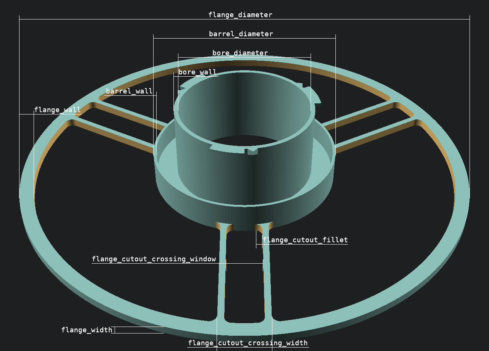

# OpenSCADSpool
Parametrizable spool primary for 3d filament

## Parameters

### Size
All sizes in mm

### flange_cutout_keep
This option keeps the cutout segment in the 3d model. You can use the slicer to make a nice wall:

1. Set "flange_cutout_keep" to true
2. Export as 3MF or AMF
3. Select cutout in slicer
4. Change slicer parameters by object
   - Wall loops: 0
   - Top shell layers: 0
   - Bottom shell layers: 0
   - Sparse infill density: Your choice
   - Sparse infill pattern: Choose between Rectilinear, Grid, Triangles, Tri-hexagon, Honeycomb or Zig Zag
5. Slice

Use "X-Y contour compensation" if the cutout does not fit into the spool.

### flange_filament_clip
A notch in the flange border to hold the filament

### flange_filament_hole_bambu
Two holes for filament fixation like on BambuLab spools.

### flange_filament_hole_inclined
Filament holes 45° inclined for easier filament insertion.

### flange_cutout_crossing_window_bore
Extend crossing window to the bore and create a gap (for cable tie)

### label_level_meter
Add a level meter label to one segment crossing

